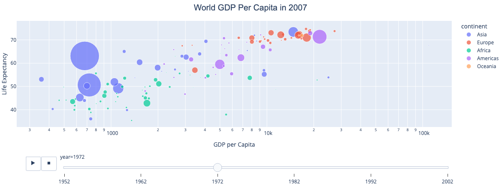

# Data Visualization Techniques in Python

A hands-on tutorial notebook covering data visualization with **Matplotlib**, **Seaborn**, and **Plotly** — from basic line and bar plots through statistical plots, multi-panel figures, and interactive dashboards.



## Contents

- [`notebooks/data_visualization_techniques.ipynb`](notebooks/data_visualization_techniques.ipynb) — the full tutorial, runnable top to bottom
- [`data/`](data) — the sample datasets used throughout (`tips`, `penguins`, `flights`, `glue`), exported from Seaborn so the notebook works offline after the first run
- [`assets/`](assets) — preview image(s) used in this README

## What's covered

**1. Basic plotting with Matplotlib**
Line plots, scatter plots, bar plots, pie charts.

**2. Statistical visualization with Seaborn**
Histograms with KDE, ridge (joy) plots, box plots, violin plots, swarm plots, heatmaps, pair plots, FacetGrids, and joint plots with regression.

**3. Interactive visualization with Plotly**
Interactive scatter/bar/pie charts, choropleth maps, animated scatter plots (Gapminder GDP vs. life expectancy over time — the source of the preview image above), and treemaps.

**4. Combining multiple visualizations**
Multi-panel Matplotlib figures with `subplots`, and interactive multi-chart dashboards with Plotly's `make_subplots`.

**5. Applied example: querying and visualizing the Gapminder dataset**
Filtering with `DataFrame.query`, reshaping with `pivot`, and layering multiple views (line, histogram, KDE, scatter, box plot) on the same dataset to tell a coherent story about global development trends.

Each technique includes a short explanation of what it's for and when to reach for it, plus a fully worked, styled example — not just the bare API call.

## Getting started

```bash
git clone https://github.com/<your-username>/data-visualization-python.git
cd data-visualization-python
pip install -r requirements.txt
jupyter notebook notebooks/data_visualization_techniques.ipynb
```

Requires Python 3.9+. The notebook loads most datasets via `seaborn.load_dataset`, which fetches them from Seaborn's own data repository the first time and caches them locally afterward; the same data is also included pre-exported in [`data/`](data) if you'd rather load it directly with `pandas.read_csv`.

## Notes on this version

This repo is a cleaned-up, verified version of the original tutorial notebook — every cell has been re-run end-to-end to confirm it executes without errors on current library versions. Along the way this surfaced and fixed a couple of real issues:

- **Dead external dependency.** The Gapminder query example originally loaded data from a `bit.ly` shortlink (`http://bit.ly/2cLzoxH`), which now returns `403 Forbidden`. It's replaced with `plotly.express.data.gapminder()` — the same dataset, bundled with Plotly, so that section now runs fully offline with no external request at all.
- **Matplotlib/Seaborn version conflict.** The regression joint-plot passed `linewidth` in `scatter_kws`, which collides with a `linewidths` default Seaborn now sets internally, raising `TypeError: Got both 'linewidth' and 'linewidths'` on current Matplotlib. Fixed by using the canonical `linewidths` key.
- A couple of minor label typos (e.g. a mislabeled axis title) were also corrected.

## Resources referenced in the notebook

- [Matplotlib documentation](https://matplotlib.org/stable/contents.html)
- [Matplotlib named colors](https://matplotlib.org/stable/gallery/color/named_colors.html)
- [Matplotlib colormaps](https://matplotlib.org/stable/gallery/color/colormap_reference.html)
- [Seaborn documentation](https://seaborn.pydata.org/)
- [Plotly documentation](https://plotly.com/python/)
- [Data-to-Viz — chart selection guide](https://www.data-to-viz.com/)

## License

[MIT](LICENSE)
